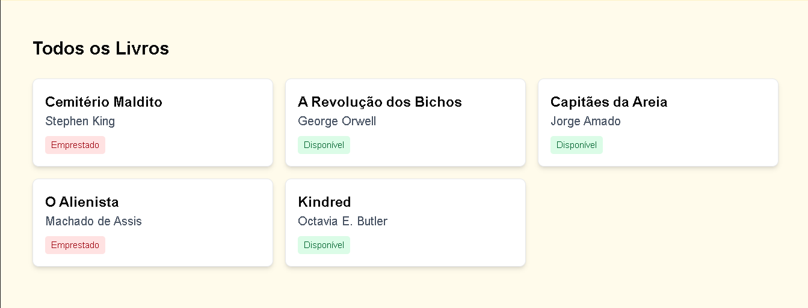
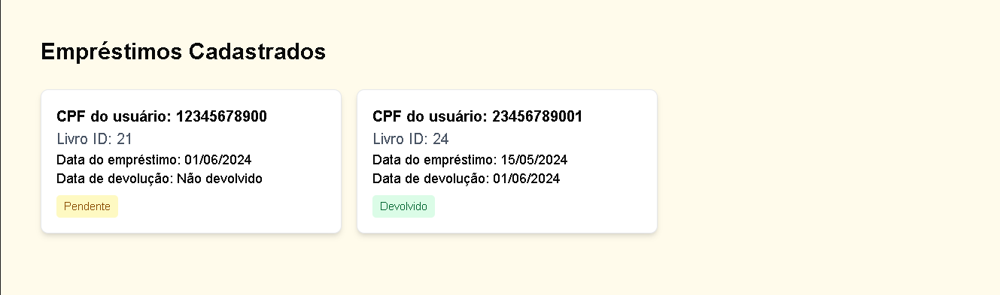
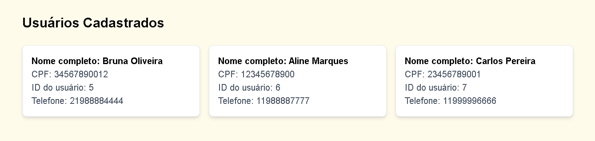

# 📚 BiblioTake 
`nextjs` `biblioteca-comunitaria` `typescript` `front-end`

**Sistema de gestão de empréstimos de livros para bibliotecas comunitárias e ONGs**  

<div align="center">
  
</div>  

---

### 🚀 Tecnologias 
    
    
    
    

---

### ❗❗ Links úteis
- [Bibliotake API](github.com/jhulyanne/bibliotake-api)
- [Deploy](bibliotake.vercel.app)
- [Apresentação do projeto]()

---

### 🛠 Como executar  
1. **Clone o repositório:**  
   ```bash  
   git clone https://github.com/jhulyanne/bibliotake-frontend.git  
   ```  

2. **Instale as dependências:**  
   ```bash  
   cd bibliotake-frontend && npm install  
   ```  

3. **Execute localmente:**  
   ```bash  
   npm run dev  
   ```  
   Acesse: [http://localhost:3000](http://localhost:3000)  

4. **Build para produção:**  
   ```bash  
   npm run build  
   ```  
---

### Seções 
### 📸 Screenshots (Adicione imagens reais)  
| Seção Livros | Seção Empréstimos | Seção Usuários |  
|--------------|-------------------|----------------|
|  |  | 
