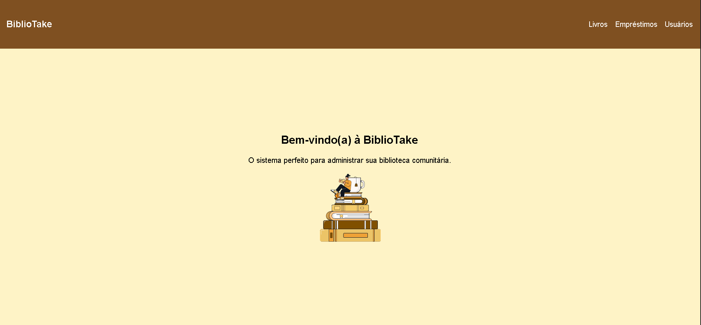
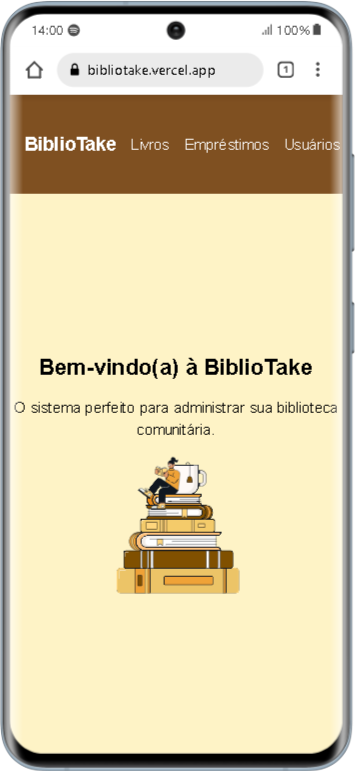
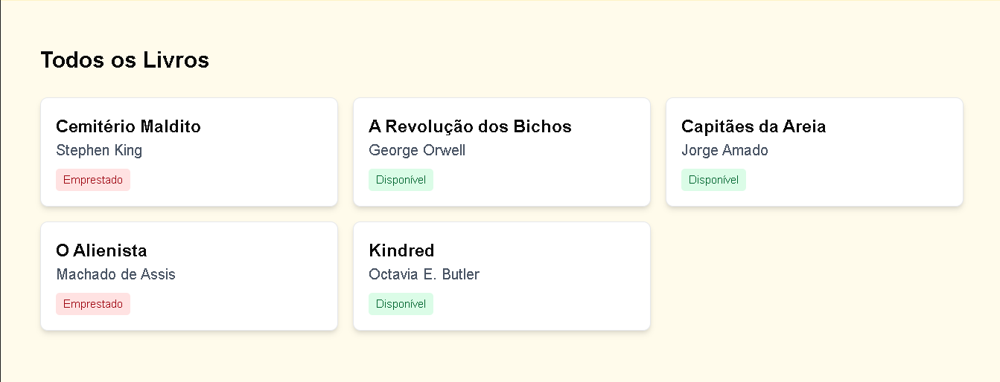
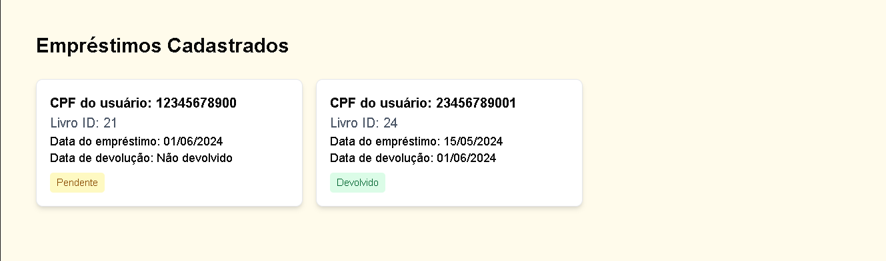
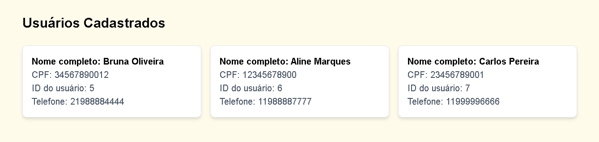
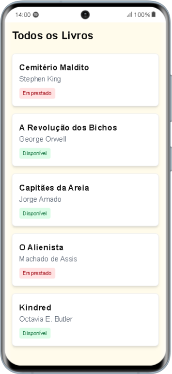
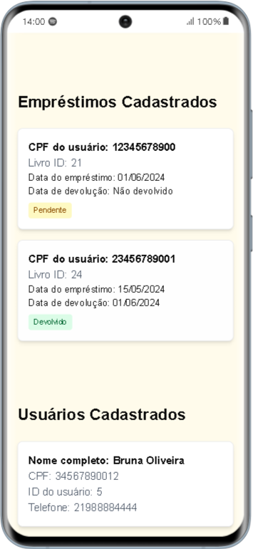
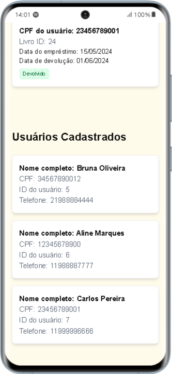

# 📚 BiblioTake 

**Sistema de gestão de empréstimos de livros para bibliotecas comunitárias e ONGs**  

<div align="center">
  
  
</div>  

---

### ❗❗ Links úteis
- [API consumida](github.com/jhulyanne/bibliotake-api)
- [Apresentação do projeto](https://www.linkedin.com/posts/jhulyanne-oliveira_reactjs-nextjs-tailwindcss-activity-7348763525617483776-o6mO?utm_source=share&utm_medium=member_desktop&rcm=ACoAAEXPIEMBml4eW1D2-FIc7c0VnD82EsX6-i8)

---

### 🚀 Tecnologias 
    
    
    
    

---

### 🛠 Como executar  
1. **Clone o repositório:**  
   ```bash  
   git clone https://github.com/jhulyanne/bibliotake-frontend.git  
   ```  

2. **Instale as dependências:**  
   ```bash  
   cd bibliotake-frontend && npm install  
   ```  

3. **Execute localmente:**  
   ```bash  
   npm run dev  
   ```  
   Acesse: [http://localhost:3000](http://localhost:3000)  

4. **Build para produção:**  
   ```bash  
   npm run build  
   ```  
---

### 📸 Seções 
| Versão | Seção Livros | Seção Empréstimos | Seção Usuários |  
|--------|--------------|-------------------|----------------|
| Desktop |  |  | |
| Mobile |  |  |  |
